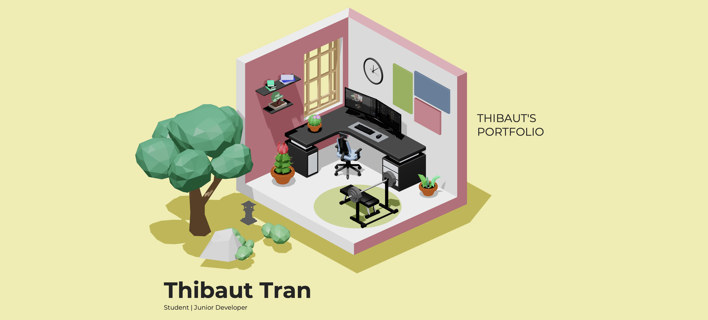

# Portfolio_3D

## Project Overview
To modernize my portfolio and push my boundaries with new technologies, I decided to rework it using 3D graphics. Drawing inspiration from the creative design of **Bokoko33.me**, I personalized the concept to craft a dynamic and interactive 3D portfolio.

By utilizing powerful tools like Three.js for 3D rendering and GSAP for seamless animations, I successfully integrated low-poly 3D objects into the site. Moreover, I mastered Blender, which enables me to now create custom 3D models tailored to my projects.

This initiative has been a significant step forward in refining my expertise in 3D web development and design.

## Key Features
- **3D Interactive Portfolio**: A visually engaging and interactive portfolio built using **Three.js** for 3D object rendering.
- **Smooth Animations**: Seamless animations powered by **GSAP** for an enhanced user experience.
- **Low-Poly 3D Objects**: Custom-designed low-poly 3D models to keep the design clean and visually appealing.
- **Blender Expertise**: Now capable of creating custom 3D models using Blender to add unique and personalized assets to the portfolio.
- **Responsive Design**: The portfolio is responsive and optimized for various screen sizes, ensuring it works well across devices.

## Technologies Used
- **Three.js**: A powerful JavaScript library for 3D rendering, used to create and manipulate 3D objects.
- **GSAP**: A popular animation library for creating high-performance animations with ease.
- **Blender**: A powerful tool for creating custom 3D models, enabling the design of any 3D assets needed for the project.
- **JavaScript (ES6)**: For scripting the logic and interactivity of the site.
- **HTML & CSS**: For structuring and styling the website, with custom animations for added effect.

## Goals Achieved
- Enhanced my **Three.js** skills, allowing me to create and manipulate 3D models.
- Gained proficiency in **GSAP** for smooth and efficient animations.
- Mastered **Blender**, allowing me to design custom 3D models for my projects.
- Created a low-poly 3D style that is modern, clean, and visually engaging.
- Delivered a fully interactive portfolio showcasing my technical and creative skills.
